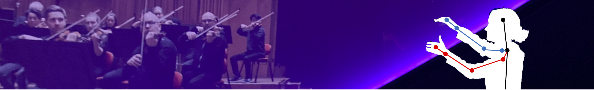

# Real Time Control of Virtual Orchestra by Recognition of Conducting Gestures 

<div align="center">

**[Mert Mermerci](mailto:mermerci@kth.se)**<sup>1</sup>,
**[Emile Pascoe](mailto:emile@smash.studio)**<sup>2</sup>,
**[Fredrik Edström](mailto:fredrik@ivar.studio)**<sup>3</sup>,
**[Hedvig Kjellström](mailto:hedvig@kth.se)**<sup>1,4</sup>

<sup>1</sup> KTH Royal Institute of Technology, Sweden &nbsp;
<sup>2</sup> SMASH Studios, Sweden &nbsp;
<sup>3</sup> IVAR Studios, Sweden &nbsp;
<sup>4</sup> Swedish e-Science Research Centre, Sweden

[comment]: Conference / Journal Name · Year

[](https://arxiv.org/abs/XXXX.XXXXX)
[](https://your-dataset-link.com)

</div>

---



---

## Abstract

We present a museum installation in a 180° dome theater, which gives the museum visitor the experience of conducting a symphony orchestra. We have pre-recorded a short music piece performed by a professional orchestra. This recording is played back in the dome with the visitor standing in the conductor's position. The visitor's gestures are captured with a vision-based skeleton tracker, steering the recording playback pace via a gesture recognition module that translates the gestures into a time control signal. This is sent to a playback module that plays the recording in the dome at the corresponding speed. The gesture recognition module is based on a hierarchical LSTM network, trained with recorded sequences of multiple conductors with different level of expertise conducting the same recording. The system is evaluated with a quantitative study of the estimated timing accuracy, a user study evaluating the musical realism and usability of the real-time control, and a field study to evaluate the performance of the entire system with real museum visitors.

---

## Video

### Commercial Video in the Wisdome Dome Theater in Stockholm. 

> Local video file — `assets/demo1.mp4`


### Interview of Sveriges Radio P2. 

> Facebook video — embedded from https://www.facebook.com/share/r/167DfQiKNi/

---

## BibTeX

```bibtex
@inproceedings{mermerci2026,
  title     = {Real Time Control of Virtual Orchestra by Recognition of Conducting Gestures},
  author    = {Mermerci, Mert and Pascoe, Emile and
               Edstr{\"o}m, Fredrik and Kjellstr{\"o}m, Hedvig},
  booktitle = {Proceedings of the Conference Name (CONF)},
  year      = {2026},
  url       = {https://arxiv.org/abs/XXXX.XXXXX}
}
```

---

<div align="center">
  This webpage template is adapted from <a href="https://github.com/nerfies/nerfies.github.io">Nerfies</a>,
  under a <a href="http://creativecommons.org/licenses/by-sa/4.0/">CC BY-SA 4.0 License</a>.
</div>
